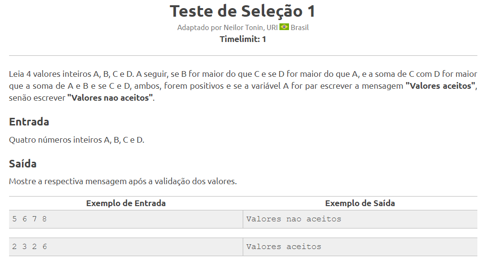
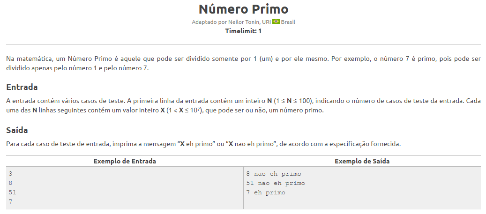

# Exercícios de .NET

Este repositório contém exercícios de .NET organizados em diferentes classes. Cada exercício está em sua própria pasta e contém o enunciado e o código-fonte necessário resolvidos pelo autor.

## Códigos dos Exercícios

0. [Menu dos exercícios](./ConsoleApp1/Program.cs)
1. [Exercício 1](./ConsoleApp1/ExercicioAula1.cs)
2. [Exercício 2](./ConsoleApp1/ExercicioAula2.cs)
3. [Exercício 3](./ConsoleApp1/ExercicioAula3.cs)
4. [Exercício 4](./ConsoleApp1/ExercicioAula4.cs)
5. [Exercício 5](./ConsoleApp1/ExercicioAula5.cs)
6. [Exercício 6](./ConsoleApp1/ExercicioAula6.cs)
7. [Exercício 7](./ConsoleApp1/ExercicioAula7.cs)
8. [Exercício 8](./ConsoleApp1/ExercicioAula8.cs)
9. [Exercício 9](./ConsoleApp1/ExercicioAula9.cs)
10. [Exercício 10](./ConsoleApp1/ExercicioAula10.cs)
11. [Exercício 11](./ConsoleApp1/ExercicioAula11.cs)
12. [Exercício 12](./ConsoleApp1/ExercicioAula12.cs)
13. [Exercício 13](./ConsoleApp1/ExercicioAula13.cs)
14. [Exercício 14](./ConsoleApp1/ExercicioAula14.cs)
15. [Exercício 15](./ConsoleApp1/ExercicioAula15.cs)
16. [Exercício 16](./ConsoleApp1/ExercicioAula16.cs)
17. [Exercício 17](./ConsoleApp1/ExercicioAula17.cs)
18. [Exercício 18](./ConsoleApp1/ExercicioAula18.cs)
19. [Exercício 19](./ConsoleApp1/ExercicioAula19.cs)
20. [Exercício 20](./ConsoleApp1/ExercicioAula20.cs)
21. [Exercício 21](./ConsoleApp1/ExercicioAula21.cs)
22. [Exercício 22](./ConsoleApp1/ExercicioAula22.cs)
23. [Exercício 23](./ConsoleApp1/ExercicioAula23.cs)
24. [Exercício 24](./ConsoleApp1/ExercicioAula24.cs)
25. [Exercício 25](./ConsoleApp1/ExercicioAula25.cs)
26. [Exercício 26](./ConsoleApp1/ExercicioAula26.cs)
27. [Exercício 27](./ConsoleApp1/ExercicioAula27.cs)
28. [Exercício 28](./ConsoleApp1/ExercicioAula28.cs)
29. [Exercício 29](./ConsoleApp1/ExercicioAula29.cs)
30. [Exercício 30](./ConsoleApp1/ExercicioAula30.cs)
31. [Exercício 31](./ConsoleApp1/ExercicioAula31.cs)
32. [Exercício 32](./ConsoleApp1/ExercicioAula32.cs)
33. [Exercício 33](./ConsoleApp1/ExercicioAula33.cs)
34. [Exercício 34](./ConsoleApp1/ExercicioAula34.cs)
35. [Exercício 35](./ConsoleApp1/ExercicioAula35.cs)
36. [Exercício 36](./ConsoleApp1/ExercicioAula36.cs)
37. [Exercício 37](./ConsoleApp1/ExercicioAula37.cs)
38. [Exercício 38](./ConsoleApp1/ExercicioAula38.cs)
39. [Exercício 39](./ConsoleApp1/ExercicioAula39.cs)
40. [Exercício 40](./ConsoleApp1/ExercicioAula40.cs)
41. [Exercício 41](./ConsoleApp1/ExercicioAula41.cs)
42. [Exercício 42](./ConsoleApp1/ExercicioAula42.cs)
43. [Exercício 43](./ConsoleApp1/ExercicioAula43.cs)
44. [Exercício 44](./ConsoleApp1/ExercicioAula44.cs)
45. [Exercício 45](./ConsoleApp1/ExercicioAula45.cs)
46. [Exercício 46](./ConsoleApp1/ExercicioAula46.cs)
47. [Exercício 47](./ConsoleApp1/ExercicioAula47.cs)
48. [Exercício 48](./ConsoleApp1/ExercicioAula48.cs)
49. [Exercício 49](./ConsoleApp1/ExercicioAula49.cs)
50. [Exercício 50](./ConsoleApp1/ExercicioAula50.cs)
51. [Exercício 51](./ConsoleApp1/ExercicioAula51.cs)
52. [Exercício 52](./ConsoleApp1/ExercicioAula52.cs)
53. [Exercício 53](./ConsoleApp1/ExercicioAula53.cs)
54. [Exercício 54](./ConsoleApp1/ExercicioAula54.cs)
55. [Exercício 55](./ConsoleApp1/ExercicioAula55.cs)
56. [Exercício 56](./ConsoleApp1/ExercicioAula56.cs)
57. [Exercício 57](./ConsoleApp1/ExercicioAula57.cs)
58. [Exercício 58](./ConsoleApp1/ExercicioAula58.cs)
59. [Exercício 59](./ConsoleApp1/ExercicioAula59.cs)
60. [Exercício 60](./ConsoleApp1/ExercicioAula60.cs)
61. [Exercício 61](./ConsoleApp1/ExercicioAula61.cs)
62. [Exercício 62](./ConsoleApp1/ExercicioAula62.cs)
63. [Exercício 63](./ConsoleApp1/ExercicioAula63.cs)
64. [Exercício 64](./ConsoleApp1/ExercicioAula64.cs)
65. [Exercício 65](./ConsoleApp1/ExercicioAula65.cs)
66. [Exercício 66](./ConsoleApp1/ExercicioAula66.cs)
67. [Exercício 67](./ConsoleApp1/ExercicioAula67.cs)
68. [Exercício 68](./ConsoleApp1/ExercicioAula68.cs)
69. [Exercício 69](./ConsoleApp1/ExercicioAula69.cs)
70. [Exercício 70](./ConsoleApp1/ExercicioAula70.cs)
71. [Exercício 71](./ConsoleApp1/ExercicioAula71.cs)
72. [Exercício 72](./ConsoleApp1/ExercicioAula72.cs)
73. [Exercício 73](./ConsoleApp1/ExercicioAula73.cs)
74. [Exercício 74](./ConsoleApp1/ExercicioAula74.cs)
75. [Exercício 75](./ConsoleApp1/ExercicioAula75.cs)
76. [Exercício 76](./ConsoleApp1/ExercicioAula76.cs)
77. [Exercício 77](./ConsoleApp1/ExercicioAula77.cs)
78. [Exercício 78](./ConsoleApp1/ExercicioAula78.cs)
79. [Exercício 79](./ConsoleApp1/ExercicioAula79.cs)
80. [Exercício 80](./ConsoleApp1/ExercicioAula80.cs)
81. [Exercício 81](./ConsoleApp1/ExercicioAula81.cs)
82. [Exercício 82](./ConsoleApp1/ExercicioAula82.cs)
83. [Exercício 83](./ConsoleApp1/ExercicioAula83.cs)
84. [Exercício 84](./ConsoleApp1/ExercicioAula84.cs)
85. [Exercício 85](./ConsoleApp1/ExercicioAula85.cs)
86. [Exercício 86](./ConsoleApp1/ExercicioAula86.cs)
87. [Exercício 87](./ConsoleApp1/ExercicioAula87.cs)
88. [Exercício 88](./ConsoleApp1/ExercicioAula88.cs)
89. [Exercício 89](./ConsoleApp1/ExercicioAula89.cs)
90. [Exercício 90](./ConsoleApp1/ExercicioAula90.cs)
91. [Exercício 91](./ConsoleApp1/ExercicioAula91.cs)
92. [Exercício 92](./ConsoleApp1/ExercicioAula92.cs)

## Enunciados Propostos 

### Exercício 1

### Exercício 2

### Exercício 3

### Exercício 4

### Exercício 5

### Exercício 6

### Exercício 7

### Exercício 8

### Exercício 9

### Exercício 10

### Exercício 11

### Exercício 12

### Exercício 13

### Exercício 14

### Exercício 15

### Exercício 16

### Exercício 17

### Exercício 18

### Exercício 19

### Exercício 20

### Exercício 21

### Exercício 22

### Exercício 23

### Exercício 24

### Exercício 25

### Exercício 26

### Exercício 27

### Exercício 28

### Exercício 29

### Exercício 30

### Exercício 31

### Exercício 32

### Exercício 33

### Exercício 34

### Exercício 35

### Exercício 36

### Exercício 37

### Exercício 38

### Exercício 39

### Exercício 40

### Exercício 41

### Exercício 42

### Exercício 43

### Exercício 44

### Exercício 45

### Exercício 46

### Exercício 47

### Exercício 48

### Exercício 49

### Exercício 50

### Exercício 51

### Exercício 52

### Exercício 53

### Exercício 54

### Exercício 55

### Exercício 56

### Exercício 57

### Exercício 58

### Exercício 59

### Exercício 60

### Exercício 61

### Exercício 62

### Exercício 63

### Exercício 64

### Exercício 65

### Exercício 66

### Exercício 67

### Exercício 68

### Exercício 69

### Exercício 70

### Exercício 71

### Exercício 72

### Exercício 73

### Exercício 74

### Exercício 75

### Exercício 76

### Exercício 77

### Exercício 78

### Exercício 79

### Exercício 80

### Exercício 81

### Exercício 82

### Exercício 83

### Exercício 84

### Exercício 85

### Exercício 86

### Exercício 87

### Exercício 88

### Exercício 89

### Exercício 90

### Exercício 91

### Exercício 92

