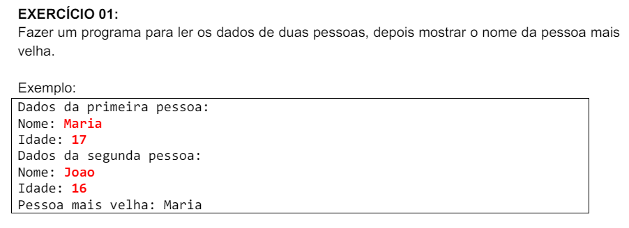

# Exercícios .NET POO

Este repositório contém uma coleção de exercícios de .NET focados em Programação Orientada a Objetos (POO). Cada exercício está organizado em sua própria pasta e inclui o enunciado e o código-fonte resolvido pelo autor. O objetivo é fornecer uma prática abrangente e gradual para aprimorar suas habilidades em .NET e POO.

## Estrutura dos Exercícios

Cada exercício está localizado em uma pasta separada dentro do projeto principal. A estrutura é a seguinte:

* Enunciado do exercício
* Diagrama UML
* Classes do exercício

## Menu de exercícios 

* [Exercício 1](#exercício-1)
* [Exercício 2](#exercício-2)

## Enunciados Propostos 

### Exercício 1

* [Program.cs](./OrientacaoObjetos.NET/ProgramPOO1.cs) - Classe Program do Exercício
* [PersonEx1.cs](./OrientacaoObjetos.NET/PersonEx1.cs) - Classe Pessoa do Exercício

### Exercício 2

* [Program.cs](./POO.NET02/ProgramPOO2.cs) 
* [EmployeeEx2.cs](./POO.NET02/EmployeeEx2.cs) 

