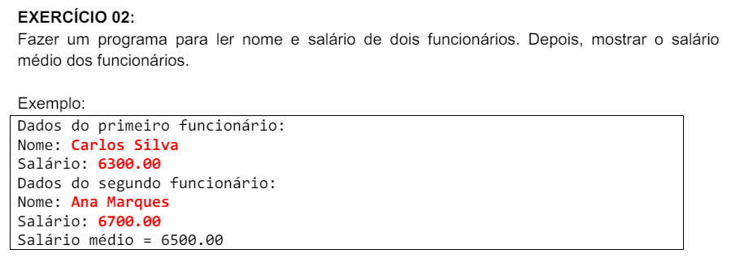

# Exercícios .NET POO

Este repositório contém uma coleção de exercícios de .NET focados em Programação Orientada a Objetos (POO). Cada exercício está organizado em sua própria pasta e inclui o enunciado e o código-fonte resolvido pelo autor. O objetivo é fornecer uma prática abrangente e gradual para aprimorar suas habilidades em .NET e POO.

## Estrutura dos Exercícios

Cada exercício está localizado em uma pasta separada dentro do projeto principal. A estrutura é a seguinte:

* Enunciado do exercício
* Diagrama UML
* Classes do exercício

## Menu de exercícios 

* [Exercício 1](#exercício-1)
* [Exercício 2](#exercício-2)
* [Exercício 3](#exercício-3)
* [Exercício 4](#exercício-4)
* [Exercício 5](#exercício-5)
* [Exercício 6](#exercício-6)
* [Exercício 7](#exercício-7)

## Enunciados Propostos 

### Exercício 1

* [Program.cs](./OrientacaoObjetos.NET/ProgramPOO1.cs) - Classe Program do Exercício
* [PersonEx1.cs](./OrientacaoObjetos.NET/PersonEx1.cs) - Classe Pessoa do Exercício

### Exercício 2

* [Program.cs](./POO.NET02/ProgramPOO2.cs) 
* [EmployeeEx2.cs](./POO.NET02/EmployeeEx2.cs)

### Exercício 3

* [Program.cs](./POO.NET03/ProgramPOO3.cs) 
* [RectangleEx3.cs](./POO.NET03/RectangleEx3.cs)

### Exercício 4

* [Program.cs](./POO.NET4/ProgramPOO4.cs) 
* [EmployeeEx4.cs](./POO.NET4/EmployeeEx4.cs)

### Exercício 5

* [Program.cs](./POO.NET05/ProgramPOO5.cs) 
* [StudentEx5.cs](./POO.NET05/StudentEx5.cs)

### Exercício 6

* [Program.cs](./POO.NET06/ProgramPOO6.cs) 
* [CurrencyConverterEx6.cs](./POO.NET06/CurrencyConverterEx6.cs)

### Exercício 7

* [Program.cs](./POO.NET07/ProgramPOO7.cs) 
* [BankAccountEx7.cs](./POO.NET07/BankAccountEx7.cs)

