# Exercícios de .NET

Este repositório contém exercícios de .NET organizados em diferentes classes. Cada exercício está em sua própria pasta e contém o enunciado e o código-fonte necessário resolvidos pelo autor.

## Códigos dos Exercícios

0. [Menu dos exercícios](./ConsoleApp1/Program.cs)
1. [Exercício 1](./ConsoleApp1/ExercicioAula1.cs)
2. [Exercício 2](./ConsoleApp1/ExercicioAula2.cs)
3. [Exercício 3](./ConsoleApp1/ExercicioAula3.cs)
4. [Exercício 4](./ConsoleApp1/ExercicioAula4.cs)
5. [Exercício 5](./ConsoleApp1/ExercicioAula5.cs)
6. [Exercício 6](./ConsoleApp1/ExercicioAula6.cs)
7. [Exercício 7](./ConsoleApp1/ExercicioAula7.cs)
8. [Exercício 8](./ConsoleApp1/ExercicioAula8.cs)
9. [Exercício 9](./ConsoleApp1/ExercicioAula9.cs)
10. [Exercício 10](./ConsoleApp1/ExercicioAula10.cs)
11. [Exercício 11](./ConsoleApp1/ExercicioAula11.cs)
12. [Exercício 12](./ConsoleApp1/ExercicioAula12.cs)
13. [Exercício 13](./ConsoleApp1/ExercicioAula13.cs)
14. [Exercício 14](./ConsoleApp1/ExercicioAula14.cs)
15. [Exercício 15](./ConsoleApp1/ExercicioAula15.cs)
16. [Exercício 16](./ConsoleApp1/ExercicioAula16.cs)
17. [Exercício 17](./ConsoleApp1/ExercicioAula17.cs)
18. [Exercício 18](./ConsoleApp1/ExercicioAula18.cs)
19. [Exercício 19](./ConsoleApp1/ExercicioAula19.cs)
20. [Exercício 20](./ConsoleApp1/ExercicioAula20.cs)
21. [Exercício 21](./ConsoleApp1/ExercicioAula21.cs)
22. [Exercício 22](./ConsoleApp1/ExercicioAula22.cs)
23. [Exercício 23](./ConsoleApp1/ExercicioAula23.cs)
24. [Exercício 24](./ConsoleApp1/ExercicioAula24.cs)
25. [Exercício 25](./ConsoleApp1/ExercicioAula25.cs)
26. [Exercício 26](./ConsoleApp1/ExercicioAula26.cs)

## Enunciados Propostos 

### Exercício 1

### Exercício 2

### Exercício 3

### Exercício 4

### Exercício 5

### Exercício 6

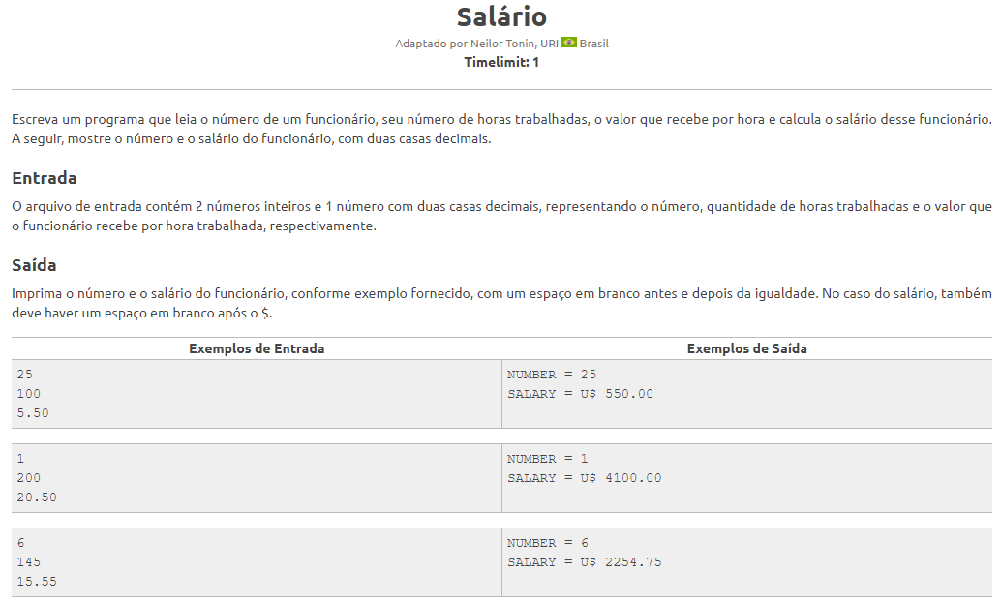

### Exercício 7

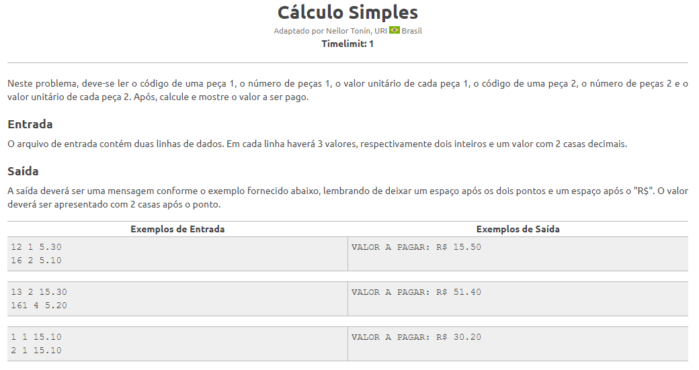

### Exercício 8

### Exercício 9

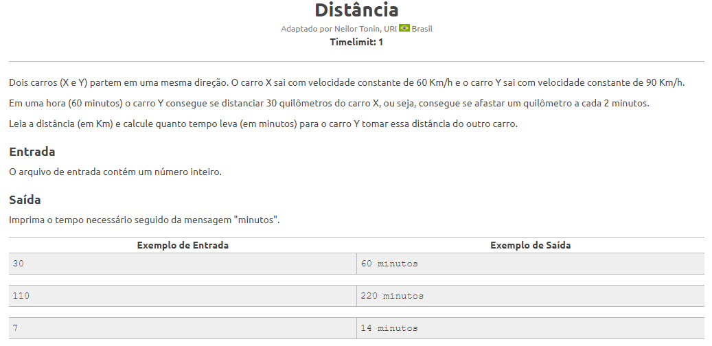

### Exercício 10

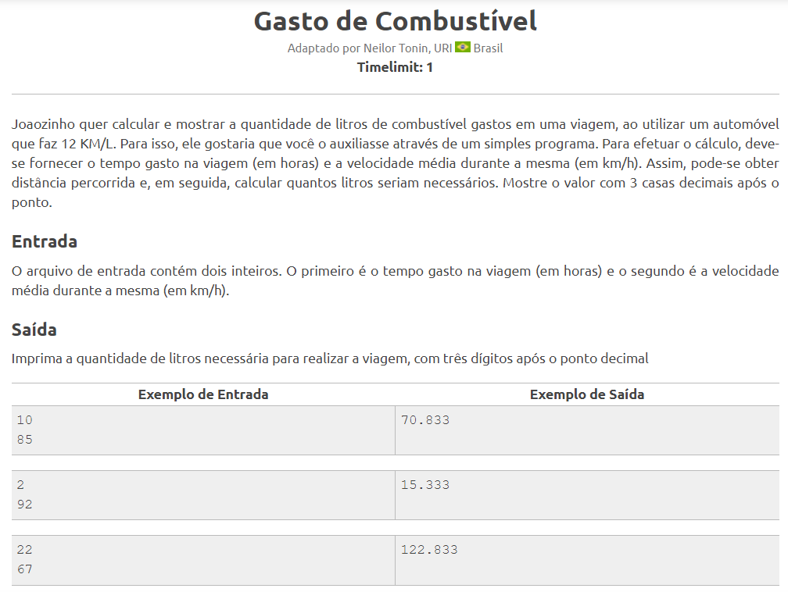

### Exercício 11

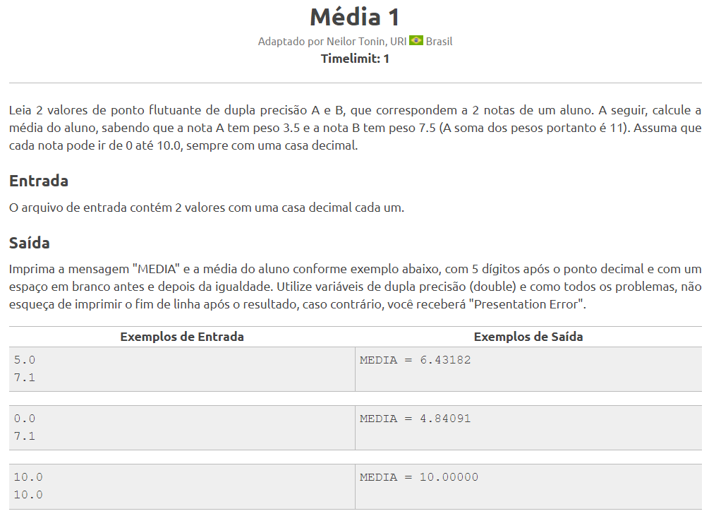

### Exercício 12

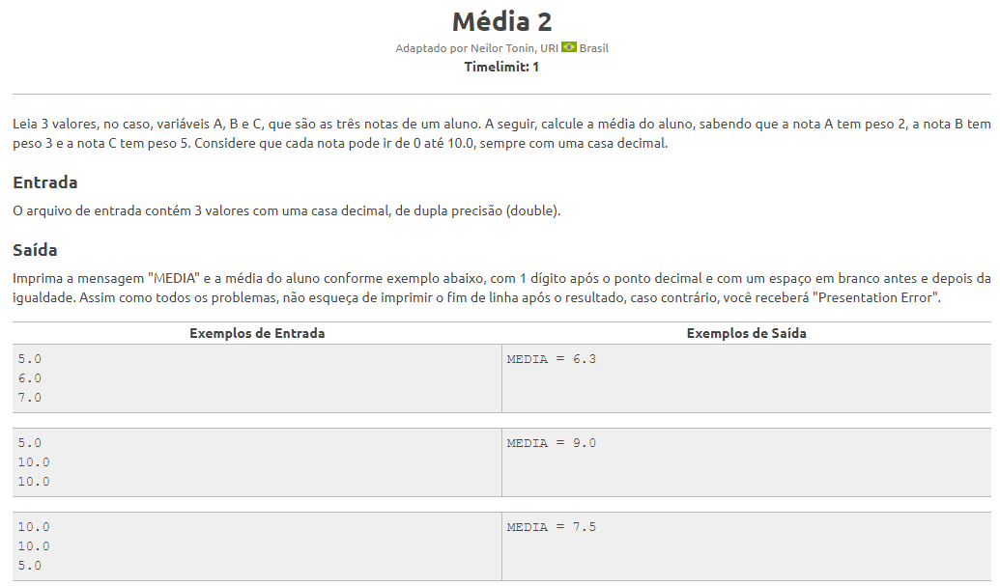

### Exercício 13

### Exercício 14

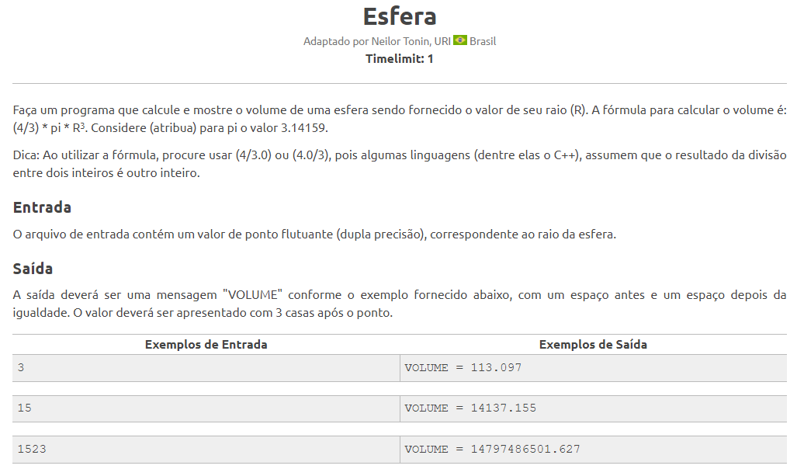

### Exercício 15

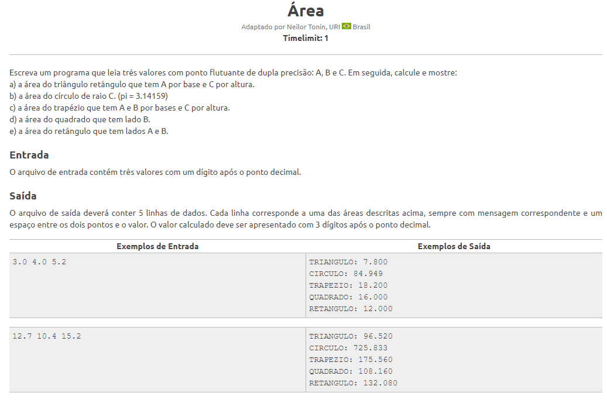

### Exercício 16

### Exercício 17

### Exercício 18

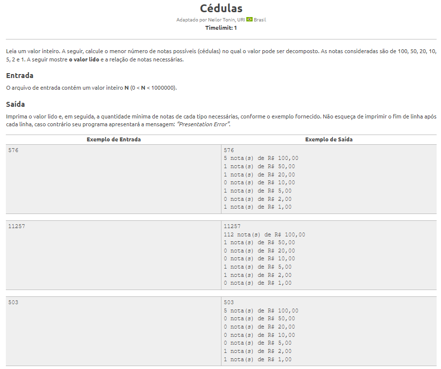

### Exercício 19

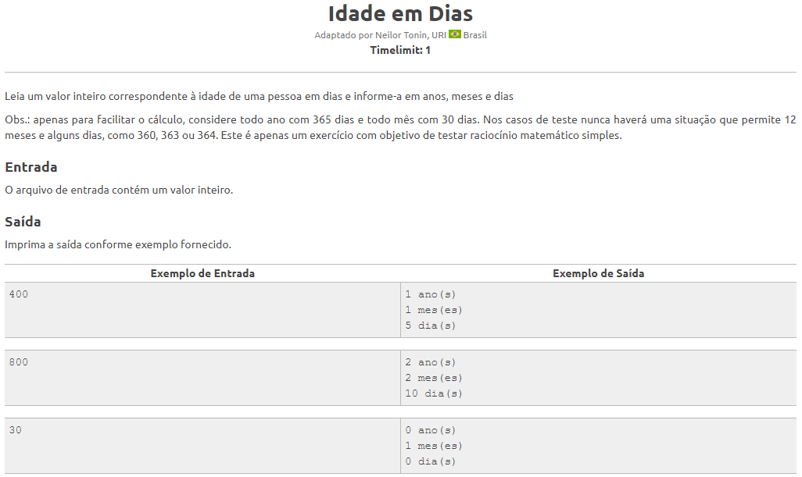

### Exercício 20

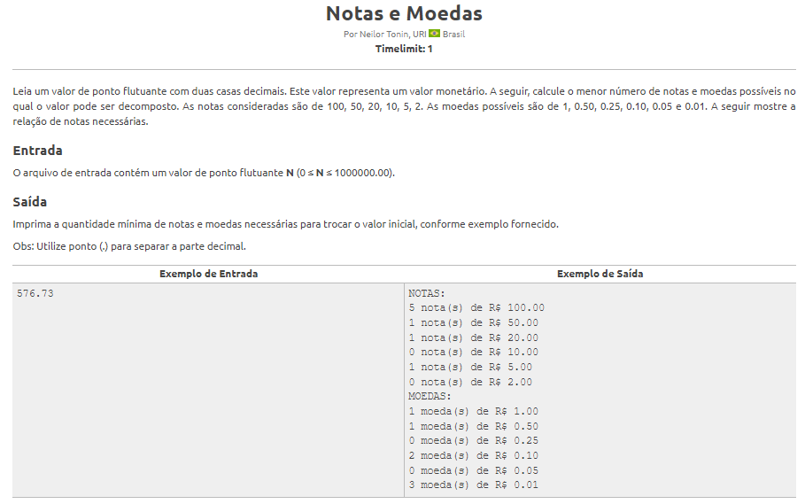

### Exercício 21

### Exercício 22

### Exercício 23

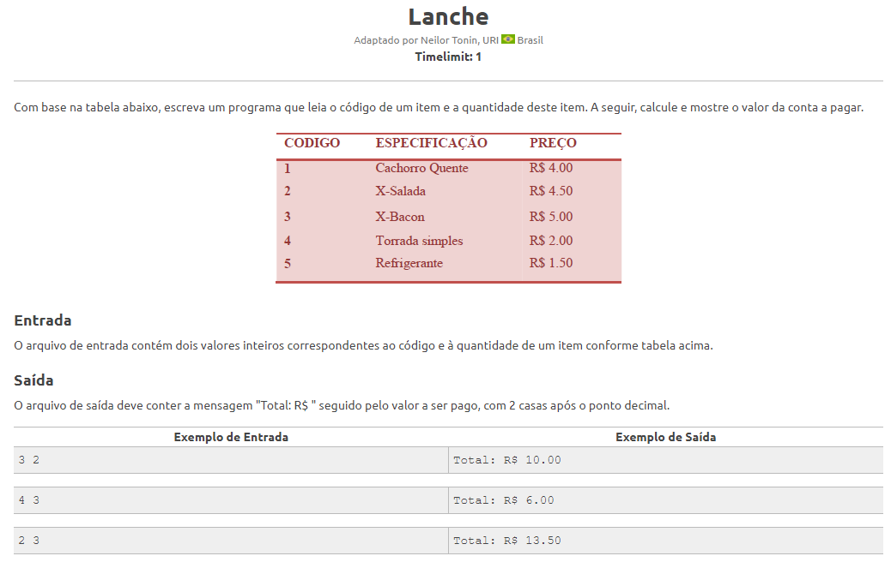

### Exercício 24

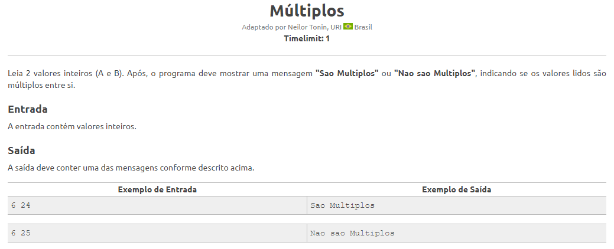

### Exercício 25

### Exercício 26

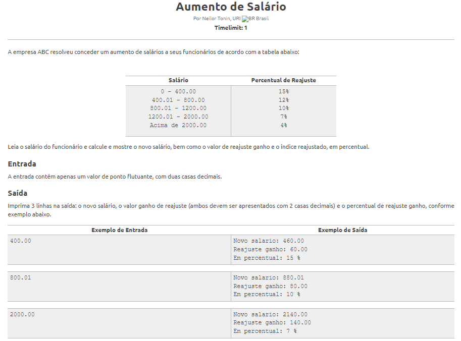

