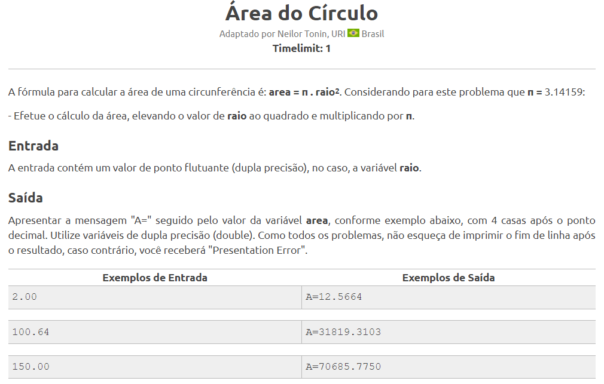
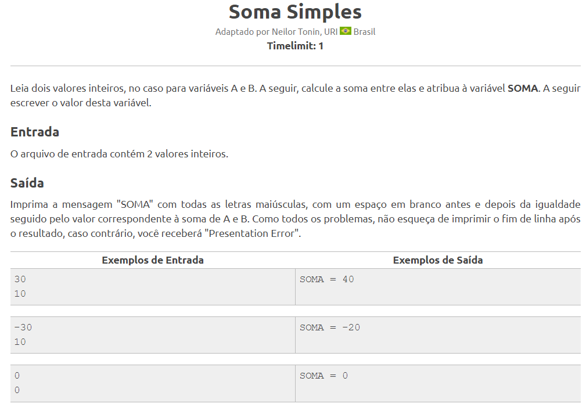

# Exercícios de .NET

Este repositório contém exercícios de .NET organizados em diferentes classes. Cada exercício está em sua própria pasta e contém o enunciado e o código-fonte necessário resolvidos pelo autor.

## Códigos dos Exercícios

0. [Menu](./ConsoleApp1/Program.cs)
1. [Exercício 1](./ConsoleApp1/ExercicioAula1.cs)
2. [Exercício 2](./ConsoleApp1/ExercicioAula2.cs)
3. [Exercício 3](./ConsoleApp1/ExercicioAula3.cs)
4. [Exercício 4](./ConsoleApp1/ExercicioAula4.cs)
5. [Exercício 5](./ConsoleApp1/ExercicioAula5.cs)
6. [Exercício 6](./ConsoleApp1/ExercicioAula6.cs)
7. [Exercício 7](./ConsoleApp1/ExercicioAula7.cs)
8. [Exercício 8](./ConsoleApp1/ExercicioAula8.cs)
9. [Exercício 9](./ConsoleApp1/ExercicioAula9.cs)

## Enunciados Propostos

### Exercício 1

### Exercício 2

### Exercício 3

### Exercício 4

### Exercício 5

### Exercício 6

### Exercício 7

### Exercício 8

### Exercício 9

