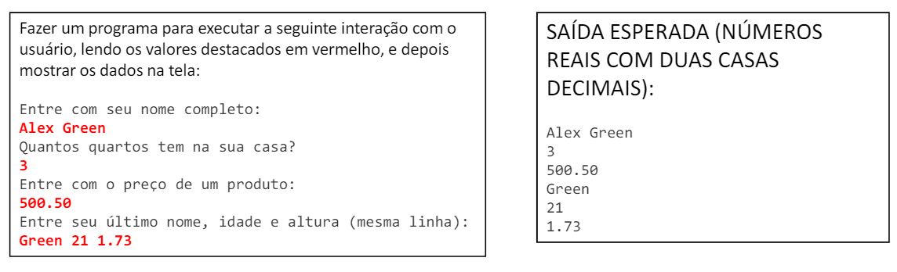

# Exercícios de .NET

Este repositório contém exercícios de .NET organizados em diferentes classes. Cada exercício está em sua própria pasta e contém o enunciado e o código-fonte necessário resolvidos pelo autor.

## Códigos dos Exercícios

0. [Menu](./ConsoleApp1/Program.cs)
1. [Exercício 1](./ConsoleApp1/ExercicioAula1.cs)
2. [Exercício 2](./ConsoleApp1/ExercicioAula2.cs)
3. [Exercício 3](./ConsoleApp1/ExercicioAula3.cs)
4. [Exercício 4](./ConsoleApp1/ExercicioAula4.cs)

## Enunciados Propostos

### Exercício 1

### Exercício 2

### Exercício 3

### Exercício 4

